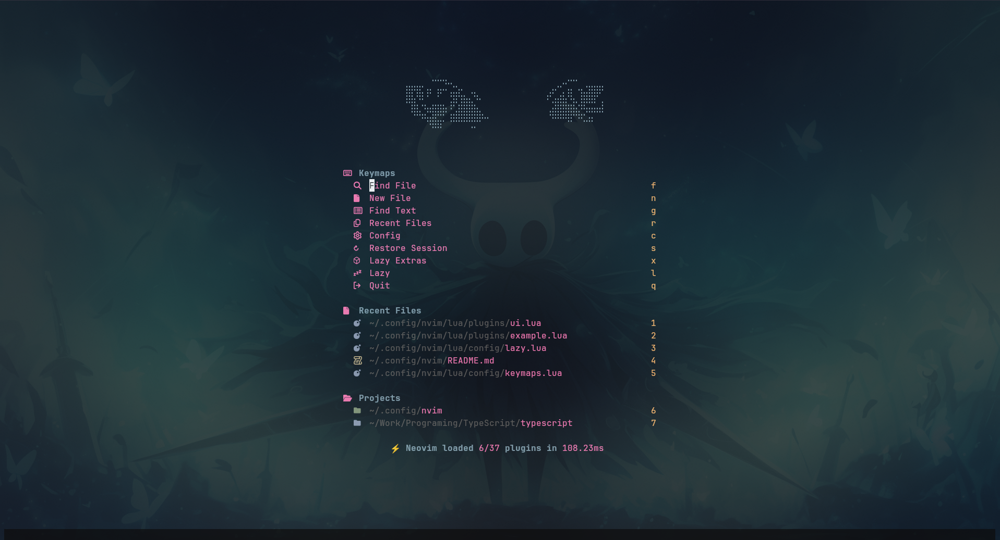
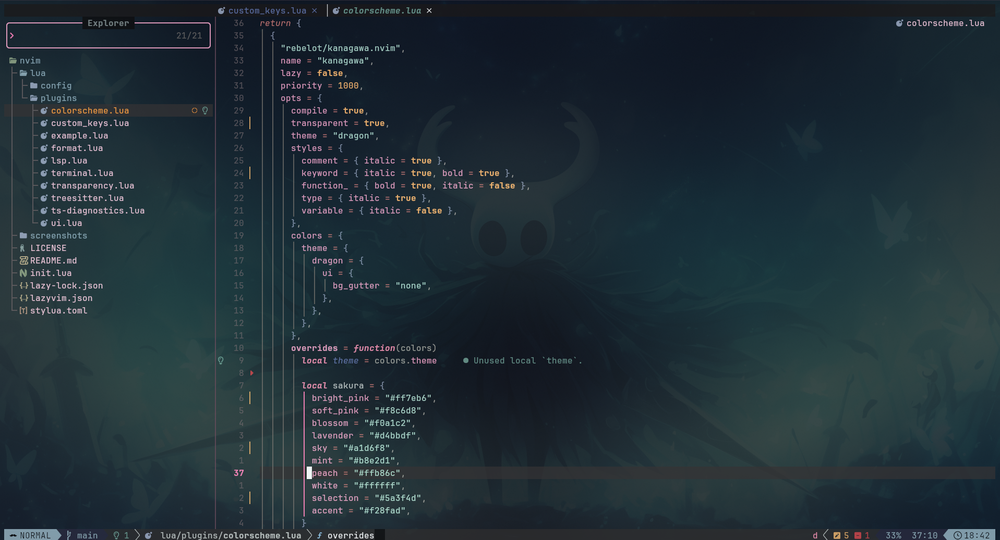

# 🌙 Neovim Config | Jerly404

<div align="center">
  
  <p><i>Mi configuración personal de Neovim basada en LazyVim, optimizada para productividad y estética minimalista.</i></p>

  <a href="https://neovim.io/">
    
  </a>
  <a href="https://www.lua.org/">
    
  </a>
  <a href="https://archlinux.org/">
    
  </a>
</div>

---

## 🚀 Sobre esta Configuración

Soy **Jerly**, estudiante de **Ingeniería de Software (8vo ciclo)** de Perú 🇵🇪.  
Este setup está diseñado para ser mi herramienta principal de desarrollo **Full-Stack**, combinando potencia, velocidad y una estética limpia inspirada en el estilo **Japandi**.

---

## ✨ Características Principales

- 📦 **Gestor de Plugins:** [Lazy.nvim](https://github.com/folke/lazy.nvim) para carga ultra rápida
- 🎨 **UI:** Dashboard personalizado con Alpha-nvim, transparencia nativa y temas modernos
- 🛠️ **Desarrollo:**  
  - TypeScript / JavaScript  
  - Angular  
  - Java (Spring Boot)  
  - Lua
- ⌨️ **Terminal:** Integración completa con Kitty / Alacritty
- ⚡ **Productividad:** Keymaps optimizados y flujo minimalista

---

## 📂 Estructura del Proyecto

```text
.
├── lua/
│   ├── config/          # Opciones, keymaps y autocmds
│   └── plugins/         # Especificaciones de plugins (UI, LSP, etc.)
├── screenshots/         # Capturas del setup
├── init.lua             # Punto de entrada
└── lazy-lock.json       # Versiones fijas de plugins
```
📸 Galería
<p align="center">   </p>
🛠️ Instalación Rápida
⚠️ Recomendación: respalda tu configuración actual antes de continuar.

bash
Copy code
# 1. Clonar el repositorio
git clone https://github.com/Jerly404/nvim-config ~/.config/nvim

# 2. Abrir Neovim (Lazy instalará todo automáticamente)
nvim
📌 Requisitos
Neovim >= 0.9

Git

Nerd Fonts (JetBrainsMono, Iosevka, etc.)

Node.js / Java (según el stack)

🤝 Contacto
📧 Email: jerly.condor@gmail.com

💻 GitHub: @jerly404

