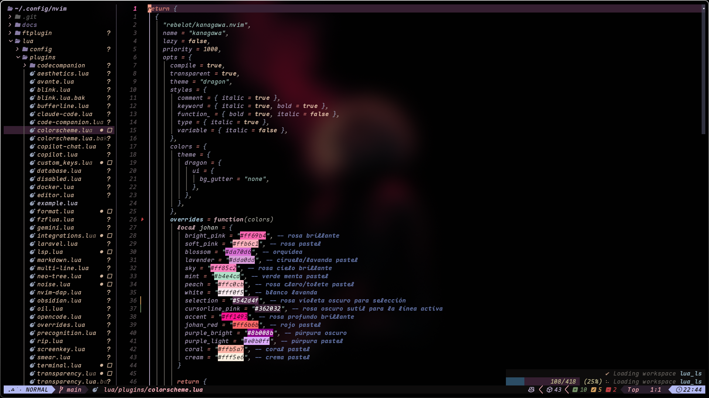
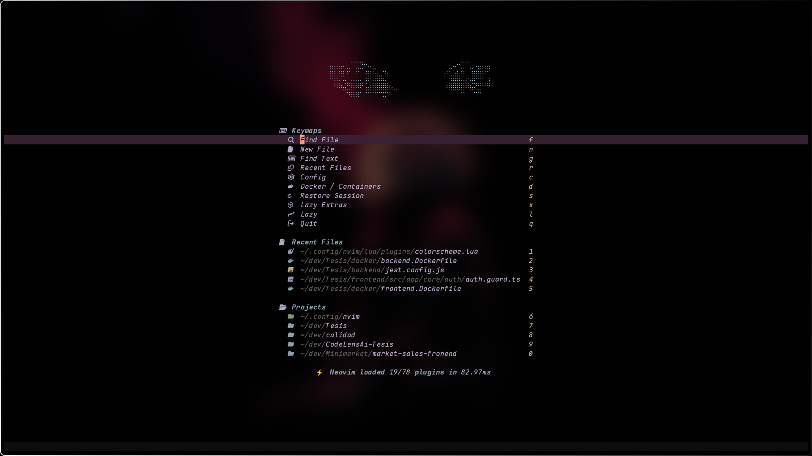
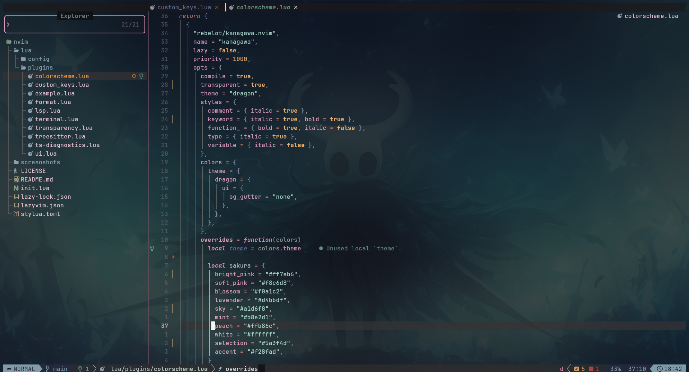
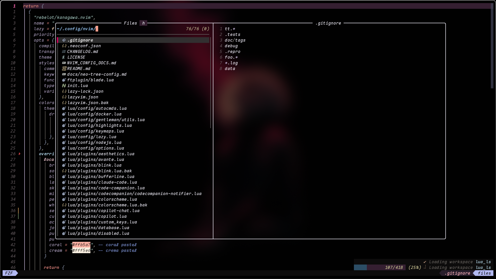

# 🌙 Neovim Config | Jerly404

<div align="center">
  
  <p><i>Mi configuración personal de Neovim basada en LazyVim, optimizada para productividad y estética minimalista.</i></p>

  <a href="https://neovim.io/">
    
  </a>
  <a href="https://www.lua.org/">
    
  </a>
  <a href="https://archlinux.org/">
    
  </a>
</div>

---

## 🚀 Sobre esta Configuración

Soy **Jerly**, estudiante de **Ingeniería de Software (8vo ciclo)** de Perú 🇵🇪.  
Este setup está diseñado para ser mi herramienta principal de desarrollo **Full-Stack**, combinando potencia, velocidad y una estética limpia inspirada en el estilo **Japandi**.

---

## ✨ Características Principales

- 📦 **Gestor de Plugins:** [Lazy.nvim](https://github.com/folke/lazy.nvim) con inicio diferido y carga ultra rápida
- 🎨 **Estética & UI:** 
  - Tema **Kanagawa Dragon** con paleta de acentos personalizada
  - Transparencia nativa optimizada para Arch Linux + Hyprland / Kitty
  - Animaciones de cursor suaves con **smear-cursor**
  - **Neo-tree** con iconos y jerarquías limpias
  - **Bufferline** y statusline minimalista
- 🤖 **Integración de IA:**
  - [Avante.nvim](https://github.com/yetone/avante.nvim) para asistencia de código integrada
  - GitHub Copilot & Copilot Chat
  - Claude Code & CodeCompanion
- 🛠️ **Desarrollo Multi-stack:**  
  - **Frontend / Full-stack:** TypeScript, JavaScript, Angular, Tailwind CSS
  - **Backend:** Laravel / PHP (con Blade & Pint), Java (Spring Boot)
  - **DevOps:** Soporte completo de Docker y contenedores
  - **Notas & Docs:** Markdown & Obsidian
- ⚡ **Productividad & Navegación:**
  - Búsqueda difusa de alta velocidad con **Fzf-Lua**
  - Navegación ágil con **precognition.nvim** y **oil.nvim**
  - Sustituciones interactivas con **rip-substitute**
  - Atajos guiados con **which-key** y navegación fluida entre terminal y ventanas

---

## 📂 Estructura del Proyecto

```text
.
├── ftplugin/            # Configuraciones específicas por tipo de archivo (Blade, etc.)
├── lua/
│   ├── config/          # Opciones globales, keymaps, autocmds y configs extras
│   └── plugins/         # Especificaciones modulares de plugins (LSP, UI, AI, etc.)
├── screenshots/         # Capturas de pantalla de la interfaz
├── init.lua             # Punto de entrada de Neovim
├── lazyvim.json         # Extras activados de LazyVim
└── lazy-lock.json       # Bloqueo de versiones deterministas de plugins
```

---

## 📸 Galería

<div align="center">
  <h3>⚡ Dashboard de Inicio</h3>
  
  <br><br>
  <h3>🎨 Editor con Explorador Neo-tree, Bufferline y Resaltado</h3>
  
  <br><br>
  <h3>🔍 Búsqueda Rápida de Archivos y Previsualización (Fzf-Lua)</h3>
  
</div>

---

## 🛠️ Instalación Rápida

> [!WARNING]
> Respalda tu configuración actual antes de continuar:
> ```bash
> mv ~/.config/nvim ~/.config/nvim.bak
> ```

```bash
# 1. Clonar el repositorio
git clone https://github.com/Jerly404/Nvim_2025.git ~/.config/nvim

# 2. Iniciar Neovim (Lazy descargará e instalará todos los plugins automáticamente)
nvim
```

---

## 📌 Requisitos

- **Neovim** >= 0.10.0
- **Git**
- **Nerd Font** instalada (e.g. Maple Mono NF, JetBrains Mono Nerd Font)
- **Herramientas de CLI:** `ripgrep`, `fd`, `fzf`
- **Node.js** y gestor de paquetes (`npm` / `pnpm`)
- Terminal con soporte de color verdadero (`truecolor`) y transparencia (recomendado: **Kitty**)

---

## 🤝 Contacto

- 📧 **Email:** jerly.condor@gmail.com
- 💻 **GitHub:** [@Jerly404](https://github.com/Jerly404)

